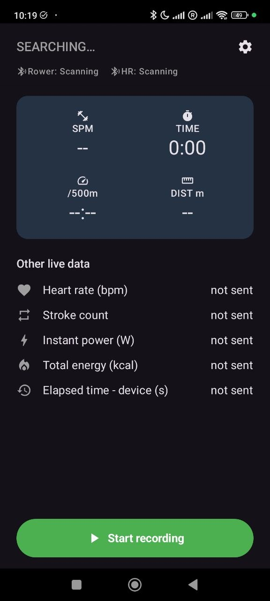
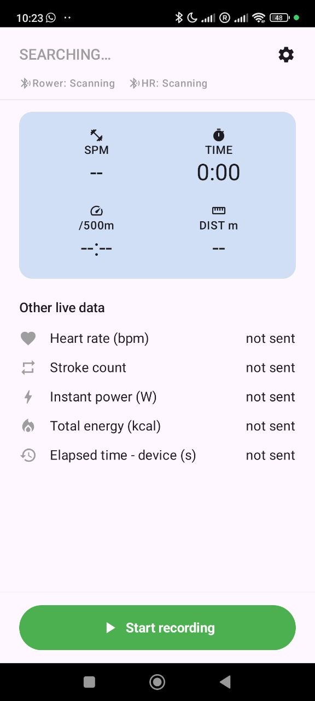

# Rowing Bridge

Android app that connects to a BLE FTMS rowing machine (and, separately, a Garmin watch's broadcast heart rate) and writes a real `.FIT` activity file — bypassing a Garmin Connect IQ limitation where Garmin Connect silently discards app-supplied values for standard metrics (distance, cadence, power, etc.) written via `ActivityRecording.Session`/`FitContributor`.

  
  

## Features

**Rower connection (BLE FTMS)**
- Scans for and connects to any rowing machine implementing the Bluetooth SIG Fitness Machine Service (FTMS), parsing the full Rower Data characteristic (stroke rate, distance, pace, power, resistance, energy, elapsed time — whatever fields the specific machine actually sends).
- Auto-reconnects if the rower drops out mid-workout, with a clear on-screen "reconnecting" state instead of silently freezing.

**Heart rate from your Garmin watch**
- Connects separately to a Garmin watch's "Broadcast Heart Rate" feature (standard BLE Heart Rate Service) for rowers that have no HR sensor of their own.
- Live bpm shown alongside the rower's metrics, and included in the recorded workout's average/max heart rate.

**Workout recording**
- Full Start / Pause / Resume / Save / Discard flow.
- Self-computes averages and maxima (stroke rate, pace, power, heart rate) for machines that don't report their own — many budget rowers only send instantaneous values.

**Real `.FIT` file export**
- Encodes a proper `.FIT` activity file using the official [Garmin FIT SDK](https://developer.garmin.com/fit/overview/) (`com.garmin:fit`), not the restricted Connect IQ recording API.
- Saves it to the phone's Downloads folder, ready for manual import into Garmin Connect — with correct Distance/Pace/Power/Calories, which a Connect IQ watch app cannot reliably produce.

**Strava upload**
- Optional one-tap upload of the saved `.fit` file to Strava (OAuth2, manual button — not automatic).
- Currently disabled pending a paid Strava API plan; wire real credentials into `local.properties` (`strava.clientId` / `strava.clientSecret`) to enable it.

**Settings**
- Light / Dark / System theme, applied instantly without restarting.
- In-app language override (English / Русский / Español), independent of the phone's system language.

## Installation

Download the latest `.apk` from the [Releases page](https://github.com/shchegol/rowing-bridge/releases) and install it directly — this app isn't on Google Play, so Android will ask you to confirm installing from an unknown source the first time. Requires Android 10 (API 29) or newer.

## Tested with

Developed and tested against a [Neeze TG002B Rowing Machine Z2](https://www.amazon.es/dp/B0C28XPHYX) (sold on Amazon.es under the "Neezee" storefront brand). Any rower implementing the standard Bluetooth FTMS Rower Data characteristic should work, but field availability varies by machine — this one, for example, never sends average stroke rate/pace/power or resistance/MET, which is why the app computes its own averages/maxima instead of trusting the device.

## Building

Requires Android Studio, JDK 17, and the Android SDK. Open the project and sync Gradle. See `local.properties` for the (optional, currently unused) Strava API credential placeholders.

## Support

If Rowing Bridge is useful to you, consider supporting it on [GitHub Sponsors](https://github.com/sponsors/shchegol) or [Buy Me a Coffee](https://buymeacoffee.com/shchegol) (no GitHub account needed) ❤ — it's a free, ad-free, one-person side project built to fix a real Garmin Connect IQ limitation, and support helps keep it maintained.

## License

The app's own source code is [MIT licensed](LICENSE). It depends on Garmin's official [FIT SDK](https://developer.garmin.com/fit/overview/) (`com.garmin:fit`) for encoding `.FIT` files, which is distributed under Garmin's own [FIT Protocol License Agreement](https://github.com/garmin/fit-java-sdk/blob/main/LICENSE.txt) — a separate, non-open-source license covering that one dependency.
